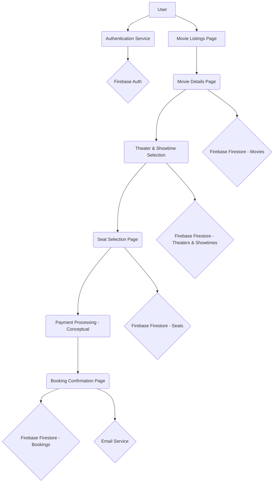

# Movie Booking App

## Overview

This is a modern movie ticket booking application built with Next.js, React, and Firebase. It allows users to browse movies, view details, select showtimes, choose seats, and book tickets seamlessly. The application aims to provide a smooth and intuitive user experience for movie enthusiasts.

## Features

- **User Authentication**: Secure sign-in and sign-up using Firebase Authentication (Google Sign-In).
- **Movie Listings**: Browse a wide selection of movies with details like title, genre, and poster.
- **Movie Details**: View comprehensive information for each movie, including synopsis, cast, and ratings.
- **Theater and Showtime Selection**: Choose from available theaters and showtimes for a selected movie.
- **Interactive Seat Selection**: Visually select desired seats for a showtime.
- **Booking Confirmation**: Receive instant confirmation of bookings with details and an option to print tickets.
- **User Profile**: View past booking history.
- **Responsive Design**: Optimized for various devices, from desktops to mobile phones.

## Relation Chart (Conceptual)



**Explanation of Key Relations:**

- **User & Authentication**: Users interact with the Firebase Authentication service for login/signup.
- **Movie Flow**: Users navigate from movie listings to details, then select theaters/showtimes, proceed to seat selection, and finally to booking confirmation.
- **Data Storage**: Firebase Firestore is used to store movie data, theater information, showtimes, seat availability, and user bookings.
- **Email Service**: A custom email service (via `emailService.js`) sends booking confirmations.

## Detailed README

### Technologies Used

- **Frontend**: Next.js, React, Tailwind CSS, Framer Motion
- **Backend/Database**: Firebase (Authentication, Firestore)
- **Email Service**: Nodemailer (via Next.js API routes)

### Project Structure

```
my-app/
├── app/                  # Next.js App Router pages and API routes
│   ├── api/              # API routes (e.g., send-email)
│   ├── booking/          # Booking related pages (selection, confirmation)
│   ├── movies/           # Movie details page
│   ├── profile/          # User profile page
│   ├── layout.js         # Root layout
│   └── page.js           # Home page
├── components/           # Reusable React components
│   ├── AuthContext.jsx   # Firebase authentication context
│   ├── Header.jsx        # Navigation bar
│   ├── HeroSection.jsx   # Homepage hero section
│   ├── MovieCard.jsx     # Individual movie display card
│   ├── SeatSelection.jsx # Seat selection UI
│   └── TheaterList.jsx   # Theater and showtime display
├── lib/                  # Utility functions and configurations
│   ├── firebaseConfig.js # Firebase initialization
│   ├── movieData.js      # Data fetching for movies (mock/API)
│   ├── emailService.js   # Email sending logic
│   └── movies.json       # Local mock movie data
├── public/               # Static assets
│   └── placeholder-poster.jpg # Placeholder image
└── ...                   # Other Next.js config files (package.json, next.config.mjs, etc.)
```

### Main Files and Their Roles

*The following file paths are provided for local reference on your machine. When viewed on platforms like GitHub, these links may not function as direct file links.*

- <mcfile name="page.js" path="d:\movie\my-app\app\page.js"></mcfile>: The main landing page, displaying featured movies.
- <mcfile name="[id]\page.jsx" path="d:\movie\my-app\app\movies\[id]\page.jsx"></mcfile>: Displays detailed information for a specific movie.
- <mcfile name="[showtimeId]\page.jsx" path="d:\movie\my-app\app\booking\[movieId]\[theaterId]\[showtimeId]\page.jsx"></mcfile>: Handles the booking process, including seat selection.
- <mcfile name="confirmation\page.jsx" path="d:\movie\my-app\app\booking\confirmation\page.jsx"></mcfile>: Displays booking confirmation details.
- <mcfile name="AuthContext.jsx" path="d:\movie\my-app\components\AuthContext.jsx"></mcfile>: Manages user authentication state across the application.
- <mcfile name="emailService.js" path="d:\movie\my-app\lib\emailService.js"></mcfile>: Contains functions for sending transactional emails.
- <mcfile name="firebaseConfig.js" path="d:\movie\my-app\lib\firebaseConfig.js"></mcfile>: Initializes and exports Firebase services.

### Setup and Installation

1.  **Clone the repository:**
    ```bash
    git clone <repository-url>
    cd movie-booking-app/my-app
    ```
2.  **Install dependencies:**
    ```bash
    npm install
    ```
3.  **Firebase Configuration:**
    - Create a Firebase project.
    - Enable Firestore and Authentication (Google Sign-in).
    - Copy your Firebase configuration to a `.env.local` file in the root of `my-app`:
    ```
    NEXT_PUBLIC_FIREBASE_API_KEY=your_api_key
    NEXT_PUBLIC_FIREBASE_AUTH_DOMAIN=your_auth_domain
    NEXT_PUBLIC_FIREBASE_PROJECT_ID=your_project_id
    NEXT_PUBLIC_FIREBASE_STORAGE_BUCKET=your_storage_bucket
    NEXT_PUBLIC_FIREBASE_MESSAGING_SENDER_ID=your_messaging_sender_id
    NEXT_PUBLIC_FIREBASE_APP_ID=your_app_id
    NEXT_PUBLIC_FIREBASE_MEASUREMENT_ID=your_measurement_id
    ```
4.  **Email Service Configuration (Optional, for sending real emails):**
    - Set up a Nodemailer transporter (e.g., with Gmail or SendGrid).
    - Add the following to your `.env.local` file:
    ```
    EMAIL_USER=your_email@example.com
    EMAIL_PASS=your_email_password_or_app_specific_password
    ```
5.  **Run the development server:**
    ```bash
    npm run dev
    ```
    Open [http://localhost:3000](http://localhost:3000) with your browser to see the result.

### Deployment

This project can be easily deployed to Vercel, Netlify, or any Node.js compatible hosting.

```bash
npm run build
npm start
```

### Contributing

Contributions are welcome! Please fork the repository and create a pull request with your changes.

### License

This project is open source and available under the MIT License.

---

<p align="center">
  
  
  
  
  
  
  
  
  
</p>