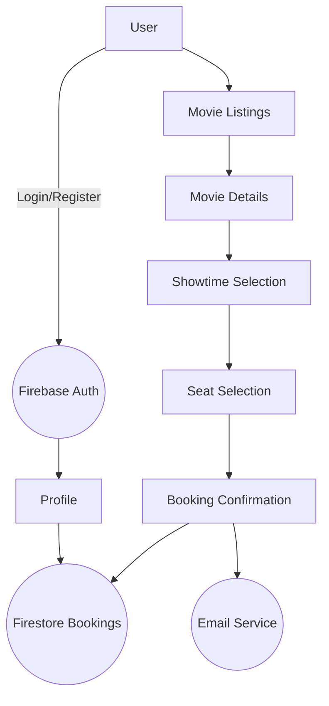

<h1 align="center" style="color:#FF4C29;">🍿 <span style="color:#2EC4B6;">CinemaHub</span> — Movie Booking Platform 🎬</h1>

<p align="center">
  <b style="font-size:1.2rem;color:#0077ff;">Discover, book, and experience movies in real-time with a vibrant, modern web app!</b>
</p>

<p align="center">
  
  
  
  
  
</p>

---

## 🌟 Overview

CinemaHub is a full-stack, real-time movie ticket booking application. Users can:

- Browse a rich movie catalog
- Select showtimes and seats interactively
- Book tickets and receive instant confirmations
- Access booking history in a beautiful, responsive UI

Built with **Next.js**, **React**, **Firebase**, **Tailwind CSS**, and integrates real email notifications.

---

## 🗺️ Linked Relation Chart



---

## ✨ Features

| Feature                     | Description                                                            |
| --------------------------- | ---------------------------------------------------------------------- |
| 🔒 Secure Auth              | Firebase Auth with Google Sign-in                                      |
| 🎥 Movie Browsing           | Explore movies, trailers, and details                                  |
| 🪑 Real-time Seat Selection | Interactive and animated seat maps                                     |
| 📨 Email Confirmations      | Instantly receive booking confirmation emails                          |
| 👤 Booking History          | Manage and review all bookings from your profile                       |
| 📱 Responsive UI            | Tailwind and Framer Motion for stunning visuals and smooth transitions |
| 🛠️ Modern Stack             | Next.js, React 18, Tailwind CSS, Firebase, Nodemailer, Framer Motion   |

---

## 🖼️ SVG & Stylish Effects

- **Custom SVG Banners:** For a unique, branded look!
- **Colorful Headings:** Using HTML/CSS for color effects.
- **Animated UI:** Framer Motion powers smooth transitions.
- **Tables & Mermaid Diagrams:** For clear structure and flow.

---

## 🏗️ Detailed Review of Main Files

### [`lib/movieData.js`](./lib/movieData.js)

- **Role:** Fetches movie listings and details from a local JSON file.
- **Key Functions:**
  - `getNowPlayingMovies()` – returns current movies
  - `getMovieDetails(id)` – fetches detailed info by ID
- **Usage:** Used by the homepage and details page for fast, mock-driven development.

### [`components/SeatSelection.jsx`](./components/SeatSelection.jsx)

- **Role:** Visual and interactive seat selection map.
- **Features:**
  - Animates seat selection with Framer Motion
  - Highlights available/unavailable seats
- **Usage:** Central to the booking flow for a rich user experience.

### [`components/HeroSection.jsx`](./components/HeroSection.jsx)

- **Role:** Eye-catching hero panel on the homepage.
- **Effects:**
  - Animated backgrounds and call-to-action
  - Responsive and theme-aware

### [`lib/firebaseConfig.js`](./lib/firebaseConfig.js)

- **Role:** Configures Firebase for authentication and Firestore data.
- **Usage:** Used app-wide for secure user management and real-time data.

### [`lib/emailService.js`](./lib/emailService.js)

- **Role:** Handles transactional emails using Nodemailer.
- **Usage:** Sends booking confirmations to users upon successful booking.

### [`app/booking/[movieId]/[theaterId]/[showtimeId]/page.jsx`](./app/booking/[movieId]/[theaterId]/[showtimeId]/page.jsx)

- **Role:** Renders the booking UI for a chosen movie/theater/showtime.
- **Features:**
  - Displays seat map, handles seat selection and booking logic.

---

## 🏁 Quickstart

```bash
git clone https://github.com/mohammed-arif-23/cinemahub.git
cd cinemahub
npm install
# Configure environment variables (see below)
npm run dev
```

Open [http://localhost:3000](http://localhost:3000) to view.

---

## ⚙️ Environment Setup

```env
NEXT_PUBLIC_FIREBASE_API_KEY=your_api_key
NEXT_PUBLIC_FIREBASE_AUTH_DOMAIN=your_auth_domain
NEXT_PUBLIC_FIREBASE_PROJECT_ID=your_project_id
NEXT_PUBLIC_FIREBASE_STORAGE_BUCKET=your_storage_bucket
NEXT_PUBLIC_FIREBASE_MESSAGING_SENDER_ID=your_messaging_sender_id
NEXT_PUBLIC_FIREBASE_APP_ID=your_app_id
EMAIL_USER=your_email@example.com
EMAIL_PASS=your_email_password
```

---

## 🚀 Future Plans

- Add payment gateway integration
- User reviews and movie ratings
- Admin dashboard

---

## 📜 License

MIT License.  
Copyright © 2025

---

## 📬 Contact & Connect

<p align="center">
  <a href="https://github.com/mohammed-arif-23" target="_blank">
    
  </a>
  <a href="https://linkedin.com/in/mohammed-arif-23" target="_blank">
    
  </a>
  <a href="mailto:mohammedarif.dev@gmail.com">
    
  </a>
 
</p>

<p align="center">
  
</p>

---

<p align="center">
  
  
  
  
  
  
</p>
